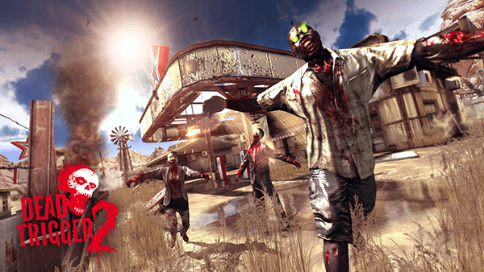

# DT2

Dead Trigger 2 is a 2013 multi-platform first-person shooter by [Madfinger Games](http://www.madfingergames.com/).

This is a local copy of Dead Trigger 2 made with Unity 5's Web Player exported to WebGL using [Emscripten](https://github.com/kripken/emscripten).

[<big><big><big>__Play now!__</big></big></big>](http://cvan.io/DT2/)

## Controls

`W`/`A`/`S`/`D` (or arrow keys) to walk, mouse to look, `Q` to switch weapons, `Tab` to switch to meleé combat, and `1`/`2`/`3` for special powers.

## Usage

Serve the files from a simple web server.

If you don't have one, create one:

    python -m SimpleHTTPServer

Then load [http://localhost:8000/](http://localhost:8000/).
